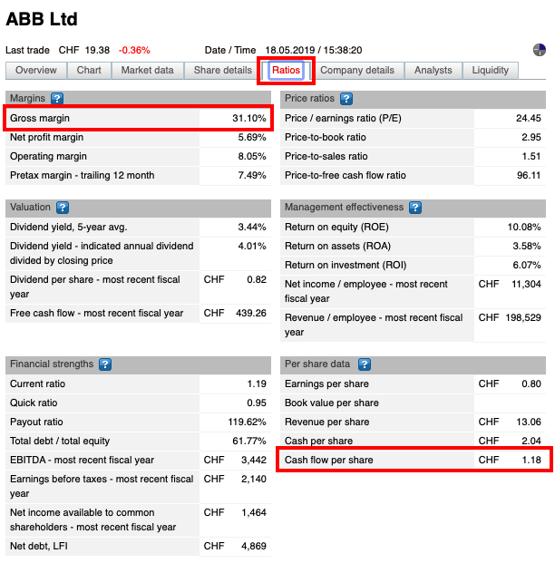
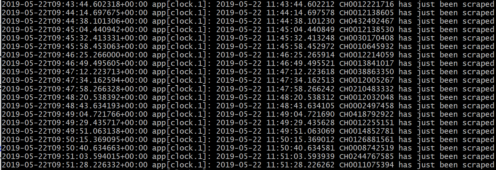
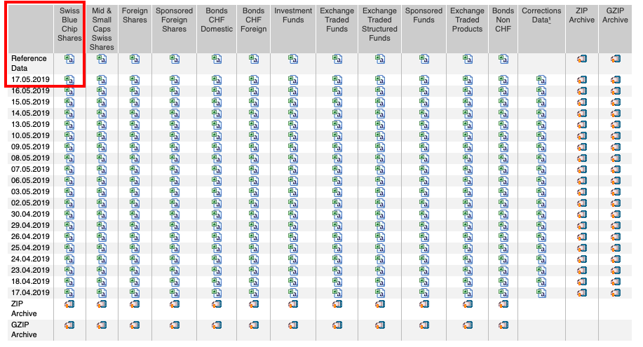
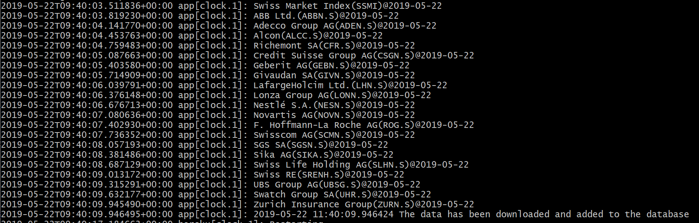

## Project Description
The goal of this programming project is to create a web app dedicated to investors searching for financial information about companies, which are part of the Swiss Market (SMI). 

The SMI is the most important index in Switzerland made up of 20 largest and most liquid large- and mid-cap stocks. Currently, the constituent companies are ABB, Adecco, Alcon, Credit Suisse, Geberit, Givaudan, LafargeHolcim, Lonza, Nestlé, Novartis, Richemont, Roche, SGS, Sika, Swatch Group, Swiss Life, Swiss Re, Swisscom, UBS and Zurich Insurance Group. The securities contained in the SMI represent approximately 80%  of the entire Swiss market capitalization, which further indicates the importance of the index.

The final output of the project is a web app called Matterhorn Lab. The web app is built upon a self-created database, which contains respective stock prices since June 2007. Additionally, daily webscraping of SIX Swiss Exchange Website is performed in order to regularly update the database. In order to provide the potential investor with more information, key financial ratios are also scraped from the SIX Website at the beginning of every month and additional performance measures are calculated. As a result, the user of Matterhorn Lab is provided with comprehensive set of data about each of the SMI stocks, including:
- Price and Return since June 2007, 
- Average Return, Return Volatily and Sharpe Ratio for periods of different length (ranging from 1 day to 10 years), 
- Value at Risk, Expected Shortfall, Maximum Drawdown, 
- Margins, Price ratios, Valuation, Management effectiveness, Financial Strengths and Per share data.

In the end, we believe that using Matterhorn Lab will help investors to make better, more-informed investment decisions. The following text is structured as follows: firstly we present learning outcomes from conducting the project, then we describe specific parts of the project as well as the code structure.

In order to access the web app please go to [Matterhorn Lab ](http://matterhorn-lab-web.herokuapp.com), select your company of interest and enjoy the content. The code files are available in created GitHub repositories for [web app](https://github.com/matterhornlab/Matterhorn-Lab-WEB) and for [database](https://github.com/matterhornlab/Matterhorn-Lab-API).


## Contents
- [Learning Outcomes](#learning-outcomes)
- [Part 1: Data Handling Using Postgres SQL](#part-1-data-handling-using-postgres-sql)
- [Part 2: Webscraping](#part-2-webscraping)
- [Part 3: Performance Measures](#part-3-performance-measures)
- [Part 4: Matterhorn Lab Web App](#part-4-matterhorn-lab-web-app)
- [Code Structure](#code-structure)
- [Authors and Licence](#authors-and-licence)


## Learning Outcomes
During the preparation of the Matterhorn Lab project, our team has significantly expanded programming knowledge in the following areas:
- Python Programming
- Postgres SQL Database Price Setup
- Heroku Set up of Python Web App Project
- Webscraping using different approaches (Requests and Selenium Modules)
- Dash Web App Programming
- Github Team Work as well as Github Markdown


## Part 1: Data Handling Using Postgres SQL
In the first part of the project we create an SQL database with prices of SMI and its constituents. We use the Heroku platform to store the database as well as to be able to deploy and run the web app later on. The initial data was downloaded from Reuters as a .csv file and goes back until 11th of June 2007, which sums up to over 60.000 entries. The database is created to perform calculations of financial performance measures on a continuous basis. In comparison, a simple .csv file would not be sufficient as it is of static format, meaning it does not allow daily actualization of data and calculations. Moreover, the database provides us with the ability to handle such a substantial amount of data in a fast and effective manner. Finally, it gives us flexibility and great potential for further applications.

We work with the Django environment to create the database as well as the web app overlay. At the same time, Python is used to appropriately handle the .csv file containing all data initially downloaded from Reuters. The process of filling entries into the database consists of the following two steps. Firstly, we define companies together with their Reuters tickers (e.g. company ABB Ltd., ticker ABBN.S), which will be put in the database. Secondly, we select daily prices for every company and add them to the database in an organized manner. 

Since the database only contains historical values, we proceed to Webscraping of SIX Swiss Exchange website in order to regularly upload the database with the newest stocks' and SMI prices.


## Part 2: Webscraping
In the second part of the project we scrape the SIX Swiss Exchange website. Our goal is to obtain prices of SMI stocks and of the SMI. Additionally, we scrape the for key financial ratios of the companies. 

Webscraping is a technique to automatically access and extract large amounts of data from a website. In order to perform it, we install the Selenium Webdriver as well as the BeautifulSoup library. Selenium is one of the most popular tools for Web UI Automation. It allows automatic execution of actions performed in a web browser such as filling forms or clicking buttons. BeautifulSoup is commonly used to pull data out of HTML and XML files and to provide idiomatic ways of navigating, searching, and modifying the parse tree.

As first preparation to scraping, we define necessary functions to clean data. Since our focus is on prices and financial ratios, we check whether downloaded variables are of float type, adequately fill in places with lack of data (treated as NaN) and change from percentage to decimal format.

We start the scraping with obtaining key financial ratios available on the SIX website. At this point, we need the following Heroku buildpacks and Heroku Config Vars:
```
Buildpacks
https://github.com/heroku/heroku-buildpack-chromedriver
https://github.com/heroku/heroku-buildpack-google-chrome

Config Vars
https://github.com/heroku/heroku-buildpack-chromedriver
https://github.com/heroku/heroku-buildpack-google-chrome
```
These buildpacks are required to make sure that the selenium module works. Buildpacks are scripts that are run when the app is deployed. They are used to install dependencies for the app and configure its environment.

After preparing dataFrame for our results, we use for loop to iterate through ISINs (International Securities Identification Numbers) of all 20 stocks constituting the SMI. We assign the ISINs to every company in a separate file, which is read into Python. Firstly, the program starts a web browser session and opens adequate URL for a particular stock. After opening the URL, Selenium clicks on the “Ratios” button to go to appropriate section of the website and waits 10 seconds to make sure the scraper is not considered a network attack. Next, Selenium hands the page source to BeautifulSoup. The program now looks at the website and finds indexes for the first and last item that we want to scrape – they are “Gross margin” and “Cash flows per share” respectively. Finally, the appropriately selected data is scraped. The example of ratios section of the website is shown on the Picture 1 below. 



The program is set to automatically download the ratios at the beginning of each month, after they are updated by the Swiss exchange. Having obtained all the ratios, the program creates a dictionary consisting of all datapoints. If datapoints are not available, they are filled with NaN. In the end, all data is merged to previously prepared dataframe. The program prints a message saying that appropriate stock has been scraped and the Selenium browser session is closed. The successful scraping for all ISINs is shown on the Picture 2 below.



In the next step of scraping process, we proceed to obtaining prices of stocks as well as of the SMI. Firstly, the program is set to try to access the webpage of SIX historical prices and download HTML. If the access is unsuccessful, the user will obtain a message of connection, timeout or general error or keyboard interruption, depending on the reason of failure. Otherwise BeautifulSoup will start the process by checking whether today’s prices are available for download. Our focus is on Swiss Blue Chip Shares file, where we can find prices of stocks constituting the SMI. The appropriate section of the website is shown on Picture 3 below. 



The closing prices are uploaded on the website at 23:35 every day. Therefore, the program is set to automatically download the newest file at 23:50 in order to make sure that the data is already available. Nevertheless, if the required file is not yet uploaded the user will get an appropriate notification. After downloading the stock prices, BeautifulSoup will open another URL and download the file with prices of the SMI. 

In the end, the downloaded stock and SMI prices are combined into a single dataframe and added to our previously prepared database. This outcome is presented on the Picture 4 below.




## Part 3: Performance Measures
Our goal is to provide useful and interesting information to the potential investor. Therefore, in the third part of the project, we prepare calculations of additional performance measures of analysed companies. Our goal is to present an accurate overview of each stock’s behaviour over time. For this reason, we perform calculations for time periods of different length, ranging from one day to almost 12 years (since the first entries in the database). 

In the first step we need to determine the number of business days for each of the considered periods. Here appropriate Python functions are used. 

Next, we proceed to obtaining the following performance measures:
- 
- 
- 
- 
- 

At this stage we refer to the database and use statistics functions readily available in Python. We also show a potential, based on historical values 10-year development of 1000 CHF investment in a particular stock, as to provide the investor with more illustrative approach.

In the end, we prepare calculations of three other, relatively more complex measures: Value at Risk (VaR), Expected Shortfall (ES) and Maximum Drawdown (MDD). Value at Risk shows maximum possible loss at a certain level of probability - in our case we take 99% confidence level. In other words, we want to let the investor know that there is only 1% chance they will lose more than the value given by VaR.  In comparison, Expected Shortfall is a more conservative measure, as it presents not the highest but the average of all values in the 1% of worst results. Finally, Maximum Drawdown measures the largest peak-to-through decline of stock’s price.


## Part 4: Matterhorn Lab Web App
In the final part of our project we use all previously collected data ad prepared calculations to present them in a form of the Matterhorn Lab web app. We aim to create an easily readable, intuitive layout containing all the most important information, which can be used by investor to make decisions regarding potential allocation of SIM stocks to their portfolio. Firstly, the user is asked to select the stock of interest from the drawdown menu at the top of the site. Then, for each stock the web app is comprised of three pages: Overview, Price Performance and Risk Measures. 

Overview contains a Summary of the company together with Company Facts, such as asset class and minimum required investment. Furthermore, a comparison of stock and SMI performance in respect to Average Annual Return (chart) and Cumulative Return (table) for periods of 1, 3, 5, 10 years is also presented. The page has a graph of Hypothetical 10.000 CHF investment in the stock as well as Risk Potential of such investment too.  

In Price Performance the user will find Current Statistics, including Average Return, Volatility, Sharpe Ratio and Return on Equity. Moreover, the Historic Prices section containing Maximum, Minimum, Range, Maximum Drawdown and Key Performance Ratios obtained on the SIX website are also displayed. 

Finally, the Risk Measures page presents Value at Risk, Expected Shortfall and Maximum Drawdown.

In this part of the project we use Python to create layout of each of the pages described above. At the top of every page we put the Matterhorn Lab logo, the dropdown menu, the pages’ tabs and the title indicating analysed stock. Then, each page is divided into 4 rows and two, left and right, columns. For each row we define its content, such as for example a piece of text or a graph. The part of code describing Row 1 of Page 1 (Overview) is shown below. 

```python
  # Row 1
                            html.Div([
                                    html.H6('Summary',
                                            className="gs-header gs-text-header padded"),
                                    html.Br([]),            
                                    
                                    html.P(id='Description'), 
                
                                        ], className="row"),  #End of Row 1           
```

Additionally, we use callback functions in order to allow navigating through the web app. The first callback function is needed to switch between the three different pages: Overview, Price Performance and Risk Measures. The second callback function refers to the dropdown menu and it recognizes the stock chosen by user as input. After that, the program downloads appropriate data from the database and calculates performance measures described in part 3. These performance measures are presented in a form of tables, charts or graphs, which outlook is also defined in the callback function. Finally, this prepared output is placed in a specific part of the page for user to view. 


## Code Structure

app.py <br />
   .gitignore <br />
   .Procfile <br />
   .requirements.txt <br />
   credentials/ <br />
      __init__.py <br />
      Credentials.py <br />
      
        .
    ├── build                   # Compiled files (alternatively `dist`)
    ├── docs                    # Documentation files (alternatively `doc`)
    ├── src                     # Source files (alternatively `lib` or `app`)
    ├── test                    # Automated tests (alternatively `spec` or `tests`)
    ├── tools                   # Tools and utilities
    ├── LICENSE
    └── README.md
    
## Authors and Licence
The Matterhorn Lab project was prepared by:
- **Sebastian A. Ott**
- **Nikola Racic**
- **Ognjen Divljak**
- **Benjamin Vömel**
- **Przemek Warnel**

This repository may only be copied upon request to one of the authors.


